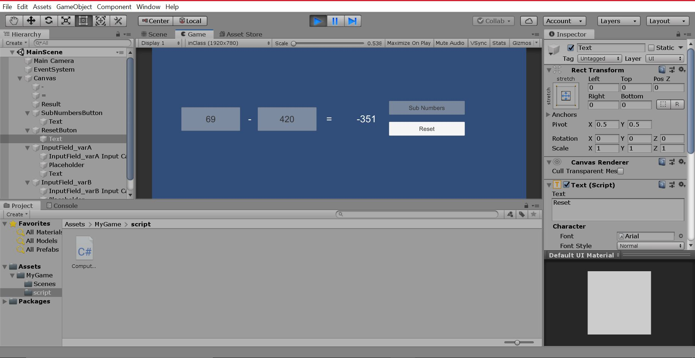

# Read Me

### Project description: 
Project to subtract numbers 

### Development platform: 
Unity 2019.1.14f1 + Visual Studio 2017

### Target platform: 
WebGL

### Visuals: 

### Project state: 
Operators finished. It's possible to subtract 2 numbers.

### Lessons Learned: 
Learned how to code a subtraction application

